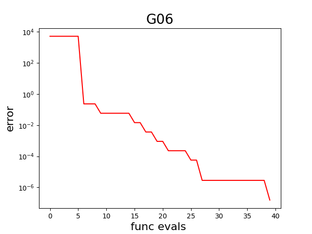
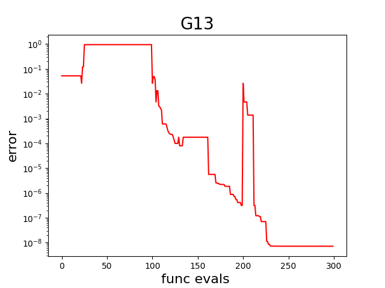

# SACOBRA_Py
[SACOBRA_Py](https://github.com/WolfgangKonen/SACOBRA_Py) is the SACOBRA Python port.

SACOBRA is a package for constrained optimization with relatively few function evaluations.

SACOBRA stands for **Self-Adjusting Constraint Optimization By Radial basis function Approximation**. It is used for numerical optimization and can handle an arbitrary number of inequality and/or equality constraints.

SACOBRA was originally developed in R. This repository **SACOBRA_Py** contains the beta version of a Python port, which is simplified in code and up to 4 times faster than the R version. (The R-version of SACOBRA is available from [this GitHub repository](https://github.com/WolfgangKonen/SACOBRA).)

## How to install

You just need to install the few packages listed in [requirements.txt](./requirements.txt) (if they are not already installed in your Python environment). Then, clone the contents of this repository and proceed with the examples.

## How to use
Below is an example from [sacobra_ineq.py](./demo/sacobra_ineq.py): 

```Python
G06 = GCOP("G06")

cobra = CobraInitializer(G06.x0, G06.fn, G06.name, G06.lower, G06.upper, G06.is_equ, solu=G06.solu,
                         s_opts=SACoptions(verbose=1, feval=40, cobraSeed=42,
                                           ID=IDoptions(initDesign="LHS", initDesPoints=6),
                                           RBF=RBFoptions(degree=2),
                                           SEQ=SEQoptions(conTol=1e-7)))
c2 = CobraPhaseII(cobra).start()

show_error_plot(cobra, G06)

fin_err = np.array(cobra.get_fbest() - G06.fbest)
print(f"final error: {fin_err}")
```

First we construct the constraint optimization problem (COP) ``G06`` from the G-problem benchmark suite.  SACOBRA contains several such benchmark problems in [gCOP.py](./src/gCOP.py). Next we construct with ``CobraInitializer`` the object ``cobra`` with all optimization settings. The optimization is then started with ``CobraPhaseII`` where 40 iterations on surrogate models are carried out. (There is also a ``CobraPhaseI``, but it is optional and can be left out.) We show with ``show_error_plot`` the error on a logarithmic scale, i.e. the distance between the objective found by the solver in each iteration and the true objective ``G06.fbest``:




Another example [sacobra_equ.py](./demo/sacobra_equ.py) with equality constraints:

```Python
G13 = GCOP("G13")

cobra = CobraInitializer(G13.x0, G13.fn, G13.name, G13.lower, G13.upper, G13.is_equ, solu=G13.solu,
                         s_opts=SACoptions(verbose=verb, feval=300, cobraSeed=cobraSeed,
                                           ID=IDoptions(initDesign="LHS", initDesPoints= 6 * 7 // 2),
                                           RBF=RBFoptions(degree=2, rho=2.5, rhoDec=2.0), 
                                           EQU=EQUoptions(muGrow=100, dec=1.6, equEpsFinal=1e-7,
                                                          refineAlgo="COBYLA")  # "L-BFGS-B COBYLA",
                                           SEQ=SEQoptions(conTol=1e-7)))     
c2 = CobraPhaseII(cobra).start()

fin_err = np.array(cobra.get_fbest() - G13.fbest)
print(f"final err: {fin_err}")
```

Problem G13 has 3 equality constraints and dimension 5. It requires with ``feval=300`` a few more function evaluations. The solver works in the beginning with approximating RBFs (``rho=2.5``) which become later interpolating RBF since ``rho`` is decaying with factor ``rhoDec=2.0``. In addition, a margin ``mu`` is placed around each equality in order to artificially create a feasible band. Parameter ``mu`` decays with the factor ``dec=1.6`` and increases periodically  every 100 iterations (``muGrow=100``). SACOBRA solves also this problem nicely, the error to the true solution drops below 1e-8 at iteration 225:



## Documentation

| title | descr|
|-------|------|
| "bla" |blabla|


< ... >

### Version History
#### V0.8
Beta Version, it contains

- LHS and random initial design
- support for arbitrary inequality and equality constraints
- cubic RBF surrogate models
- both interpolating and approximating RBFs
- the majority of G-problems from the G-problem benchmark suite

and it was extensively tested on these G-problems.

It is missing

- a thorough documentation
- other initial designs
- other RBF surrogate models
- (surrogate) model selection
- repair of infeasible solutions
- the optional ``CobraPhaseI``

## Publications
You can read more about SACOBRA in the following scientific publications:

< ... >

