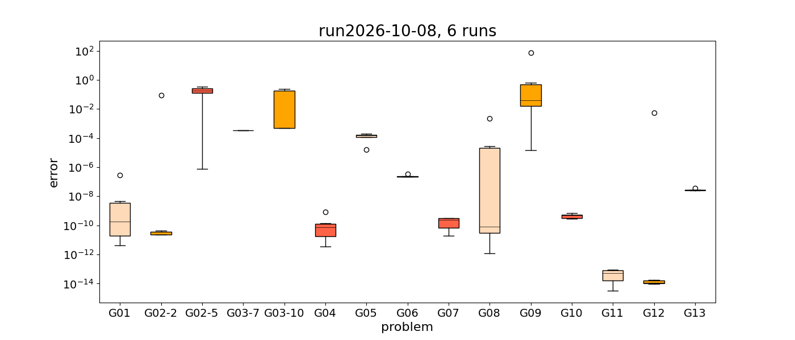
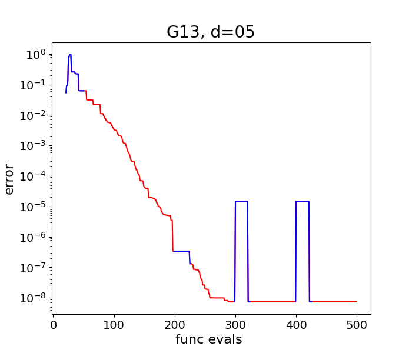

------------------------
Reproducible Experiments
------------------------
This chapter shows how to perform reproducible experiments with **SACOBRA_Py**.

Experiments with G-problems
---------------------------
Method :meth:`.OneS.one_s_multi_g_r` described below allows to perform reproducible experiments with detailed output.
Each run ``r`` is started with a specific seed ``cobraSeed+r`` which is saved in :ref:`dfsum <dfsum-label>`.
Each call generates a unique directory ``test/feather/run%Y-%m-%d_%Hh%Mm%S`` (year-month-day_hour-minute-second)
which contains upon successful completion the following files:

- ``box_run%Y-%m-%d.png``: summary box plot with a error box for each ``(gname,dim)``-combination
- ``dfsum.csv``: data frame :ref:`dfsum <dfsum-label>`, CSV format
- ``dfsum.feather``: data frame :ref:`dfsum <dfsum-label>`, feather format
- ``%gname_%dim_%meth_%run.png``: plot error-vs-iterations for each ``(gname,dim,meth,run)``-combination
- ``%gname_%dim_%meth_%run_df1.feather``: data frame ``df`` for this run
- ``%gname_%dim_%meth_%run_df2.feather``: data frame ``df2`` for this run
- ``%gname_%dim_%meth_sac_opts.pickle``: :class:`.SACoptions` optimization settings ``cobra.sac_opts`` for this ``(gname,dim,meth)``-combination
- ``med_std_grp.csv``: group data frame ``dfsum`` by ``(gname,dim,meth)`` with operators median and standard deviation
  and write results to new data frame with columns ``time,err,...,std_time,std_err``
- ``s_opts.pickle``: :class:`.SACoptions` optimization settings ``cobra.sac_opts`` (last run)

It is recommended that the last run uses ``meth='one_s'``, then the settings saved to ``s_opts.pickle`` are those valid
for **all** ``'one_s'`` runs.

An example box plot for a run G01 - G13 is shown here (click on image to enlarge):

An example error plot for a run G13 is shown here (click on image to enlarge):

The valid regions are the red regions where :math:`\mu\leq\mu_{final}` holds. In the blue regions we have :math:`\mu > \mu_{final}`
(artificially enlarged feasibility regions around the equality lines). Due to the larger feasibility regions, there can
be infill points with lower or even negative errors, which appear as larger values, because we plot :math:`|err|`.
This seemingly 'better-thn-true-objective' points are an artefact of the enlargement.

.. autoclass:: one_s_multi_g.OneS
   :members: one_s
   :no-index:

.. _dfsum-label:

.. autoclass:: one_s_multi_g.OneS
   :members: one_s_multi_g_r,

Details:

**err**: should be normally a very small but positive value. If a negative value occurs, this indicates
that the found solution has a seemingly better objective than the true best objective is. This happens if the
found solution was found under relaxed conditions (:math:`\tau > 0` or a large :math:`\mu_{final}` that
is not reflected by GCOP.solu), that allowed for a “better-than-optimal”-solution. Or it happens if the true best
objective is not really the optimal one.

**conTol**: constraint tolerance :math:`\tau`, copied from ``cobra.sac_res.SEQ.conTol``:  The usual setting is
:math:`\tau = 0`, but a slightly positive value :math:`\tau > 0` may be used for difficult COPs in order to see if a
near-feasible solution can be found that fulfills

$$   g_{i}(\\vec{x}) \\leq \\tau,  \\qquad  \|h_{j}(\\vec{x})\|-\\mu_{final} \\leq \\tau    $$

**maxViol**: maximum **true** constraint violation of the best feasible solution found.

**maxConstr**: maximum constraint for the best feasible solution :math:`\vec{x}_b` found:

$$  \\mbox{maxConstr} = \\max \\{g_{i}(\\vec{x}_b), h_{j}(\\vec{x}_b)\\}    $$

If the maximum is at an equality constraint, then the number can be positive up to :math:`\mu_{final}`, and
the solution is still feasible.
