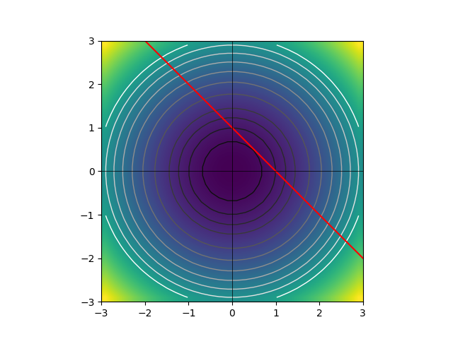
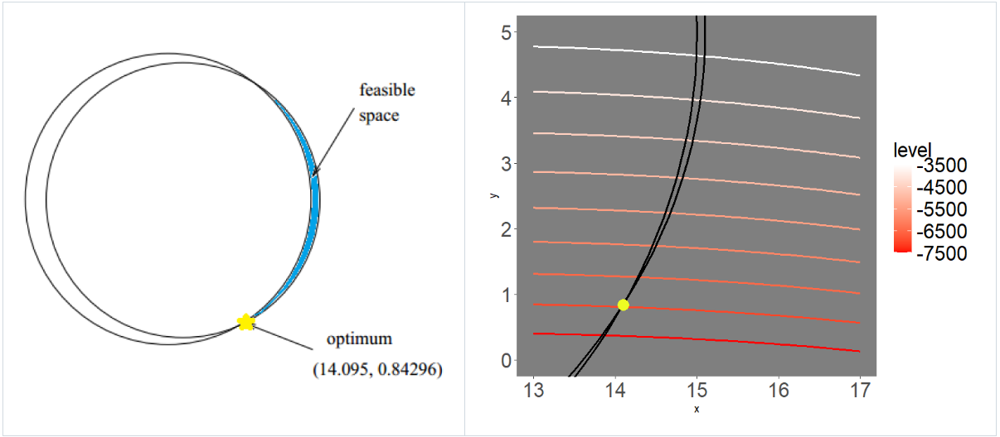
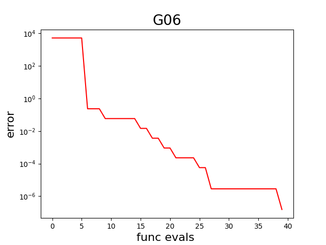
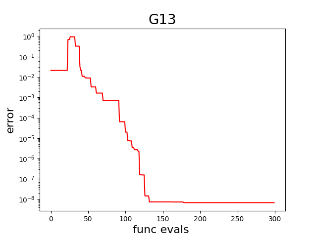

----------------
Examples
----------------

This chapter shows how to use **SACOBRA_Py**.

A First Example
----------------

This example can be found in `first_example.py <../../../demo/first_example.py>`_:

.. code-block::

    import numpy as np
    from cobraInit import CobraInitializer
    from cobraPhaseII import CobraPhaseII
    from gCOP import COP, show_error_plot

    class MyCOP(COP):
        def __init__(self):
            super().__init__()
            self.name = 'first example'
            self.fn = lambda x: np.array([3 * np.sum(x ** 2), 1 - np.sum(x)])
            self.fbest = 1.5
            self.lower = np.array([-5,-5])
            self.upper = np.array([+5,+5])
            self.is_equ = np.array([False])
    cop = MyCOP()

    cobra = CobraInitializer(None, cop.fn, cop.name, cop.lower, cop.upper, cop.is_equ)

    c2 = CobraPhaseII(cobra).start()

    print(f"xbest: {cobra.get_xbest()}")
    print(f"fbest: {cobra.get_fbest()}")
    print(f"final error: {cobra.get_fbest() - cop.fbest}")

    show_error_plot(cobra, cop)

The constraint optimization problem ``cop`` consists of a 2-dimensional sphere objective with center at the origin
and a linear constraint

.. raw:: latex html

	\[  g(\vec{x}) = 1 - \sum_i {x_i} \leq 0 \]

which defines the feasible space as the space on and above the straight line passing through :math:`(0,1)` and :math:`(1,0)`.
The true solution is the point of this space closest to the origin, i.e. :math:`\vec{x}_s = (0.5,0.5)` with
:math:`f(\vec{x}_s) = 3\vec{x}_s\cdot \vec{x}_s = 1.5`.

A sketch of the COP is shown here (click on image to enlarge):

We initialize **SACOBRA_Py** with default options, start phase-II-optimization and obtain a very satisfactory result
with error < 9 e-13.

G06 with Inequality Constraints
-------------------------------

This example can be found in `sacobra_ineq.py <../../../demo/sacobra_ineq.py>`_:

.. code-block::

    import numpy as np
    from gCOP import GCOP, show_error_plot
    from cobraInit import CobraInitializer
    from cobraPhaseII import CobraPhaseII
    from opt.sacOptions import SACoptions
    from opt.idOptions import IDoptions
    from opt.rbfOptions import RBFoptions
    from opt.seqOptions import SEQoptions

    G06 = GCOP("G06")

    cobra = CobraInitializer(
                G06.x0, G06.fn, G06.name, G06.lower, G06.upper, G06.is_equ, solu=G06.solu,
                s_opts=SACoptions(verbose=1, feval=40, cobraSeed=42,
                                  ID=IDoptions(initDesign="LHS", initDesPoints=6),
                                  RBF=RBFoptions(degree=2),
                                  SEQ=SEQoptions(conTol=1e-7)))
    c2 = CobraPhaseII(cobra).start()

    show_error_plot(cobra, G06, file="../demo/error_plot_G06.png")

    fin_err = np.array(cobra.get_fbest() - G06.fbest)
    print(f"final error: {fin_err}")

We first load G06 from the G-problem benchmark suite. G06 is a 2D problem with
two circular-shaped inequality constraints such that the feasible region is a very narrow crescent-shaped region.
A sketch of G06 is shown here (click on image to enlarge):

The object
:class:`.CobraInitializer` ``cobra`` is initialized with the G06 problem characteristica and its :class:`.SACoptions`
are set:

     - 40 function evaluations, seed 42, latin hypercube sampling (LHS) initial design with 6 points, cubic RBF with polynomial tail of degree 2, sequential optimization with constraint violation tolerance of :math:`10^{-7}`.

Now the optimization is started with :class:`.CobraPhaseII`. The object ``cobra`` is modified and enriched by this
optimization: The data frames ``cobra.df`` and ``cobra.df2`` are extended row-by-row with each iteration and they
contain diagnostic information. The dictionary ``cobra.sac_res`` is extended as well: For example, the array
``cobra.sac_res['fbestArray']`` has the evolution of the best fitness (objective) value over iterations.

This is used by ``show_error_plot`` to display the error curve, which is also saved in PNG file ``error_plot_G06.png``
(click on image to enlarge):

Finally, the final error (difference between the objective value found by the optimizer in the last iteration and the true objective ``G06.fbest``) is computed and printed.

G13 with Equality Constraints
-------------------------------

This example can be found in `sacobra_equ.py <../../../demo/sacobra_equ.py>`_:

.. code-block::

    import numpy as np
    from gCOP import GCOP, show_error_plot
    from cobraInit import CobraInitializer
    from cobraPhaseII import CobraPhaseII
    from opt.equOptions import EQUoptions
    from opt.sacOptions import SACoptions
    from opt.idOptions import IDoptions
    from opt.rbfOptions import RBFoptions
    from opt.seqOptions import SEQoptions

    G13 = GCOP("G13")

    cobra = CobraInitializer(
               G13.x0, G13.fn, G13.name, G13.lower, G13.upper, G13.is_equ, solu=G13.solu,
               s_opts=SACoptions(verbose=1, feval=300, cobraSeed=42,
                                 ID=IDoptions(initDesign="LHS", initDesPoints=6*7//2),
                                 RBF=RBFoptions(degree=2, rho=2.5, rhoDec=2.0),
                                 EQU=EQUoptions(muGrow=100, muDec=1.6, muFinal=1e-7,
                                                refineAlgo="COBYLA"),
                                 ISA=ISAoptions2(TGR=1000.0),
                                 SEQ=SEQoptions(conTol=1e-7)))
    c2 = CobraPhaseII(cobra).start()

    show_error_plot(cobra, G13, file="../demo/error_plot_G13.png")

    fin_err = np.array(cobra.get_fbest() - G13.fbest)
    print(f"final error: {fin_err}")

We first load G13 from the G-problem benchmark suite. G13 is a problem with 3 equality constraints. The rest is very much the same as in the example before, except that the following new options in :class:`.SACoptions` are set: 

       - 300 function evaluations,
       - RBF modeling starts with smoothing factor :math:`\rho=2.5` which means *approximating RBFs*. Parameter :math:`\rho=2.5` is exponentially decaying towards 0 with  factor ``rhoDec=2.0``. If :math:`\rho=0` or if it is very small, then we have *interpolating RBFs*.
       - Equality handling with margin :math:`\mu` (see :class:`.EQUoptions`), where :math:`\mu` is decaying exponentially with factor 1.6 from :math:`\mu_{init}` towards :math:`\mu_{final} = 10^{-7}`, but re-growing every ``muGrow=100`` iterations again to the large initial :math:`\mu_{init}.` As refine algo (see :class:`.EQUoptions`) we use "COBYLA" from package ``nlopt``. 
       - As an example we show how ``ISA`` is initialized with derived class :class:`.ISAoptions2` where all the defaults from :class:`.ISAoptions2` are taken, except that threshold ``TGR=1000`` is set. (:class:`.ISAoptions` would also produce low errors, but :class:`.ISAoptions0` is not recommended, it would produce much too large errors).

The resulting error curve in PNG file ``error_plot_G13.png`` (click on image to enlarge):

